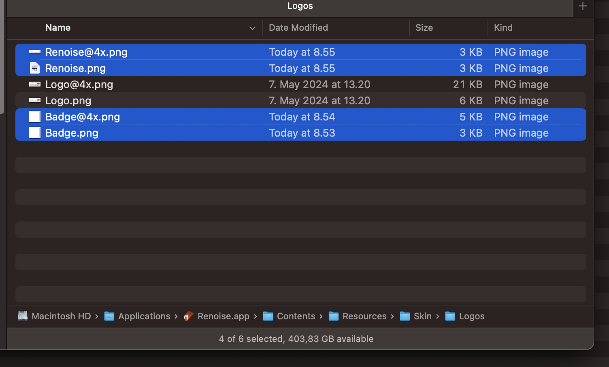

- Renoise@4x.png
- Renoise.png
- Badge@4x.png
- Badge.png

on macOS they go to `Contents/Resources/Skin/Logos/` inside your `Renoise.app`




for Linux:
```
/usr/share/renoise-3.4.4/Skin/Logos/Badge.png
/usr/share/renoise-3.4.4/Skin/Logos/Badge@4x.png
/usr/share/renoise-3.4.4/Skin/Logos/Renoise.png
/usr/share/renoise-3.4.4/Skin/Logos/Renoise@4x.png
```


